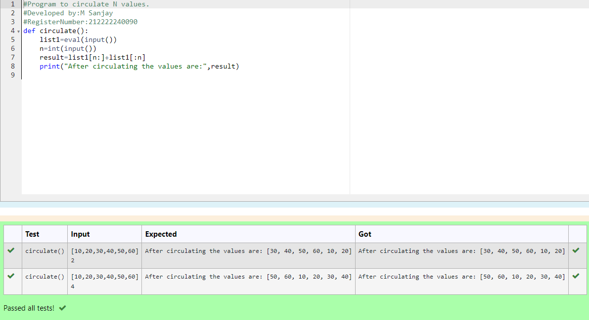

# Circulate-the-values-of-N-variables
## Aim:
To write a python program to circulate the n variables using function concept
## Equipment’s required:
PC
Anaconda - Python 3.7
## Algorithm: 
### Step 1: 
Get the values from the user
### Step 2: 
Assign the value of variable to a temporary variable
### Step 3: 
Get the value from the user for the number of rotation
### Step 4: 
Using the slicing concept rotate the list
### Step 5: 
Print both the values it would be interchanged
### Step 6: 
End the program
## Program:
```
#Program to circulate N values.
#Developed by:M Sanjay
#RegisterNumber:212222240090
def circulate():
    list1=eval(input())
    n=int(input())
    result=list1[n:]+list1[:n]
        print("After circulating the values are:",result)
```
## Output:



## Result:
THIS PROGRAM WAS EXECUTED SUCCESSFULLY
